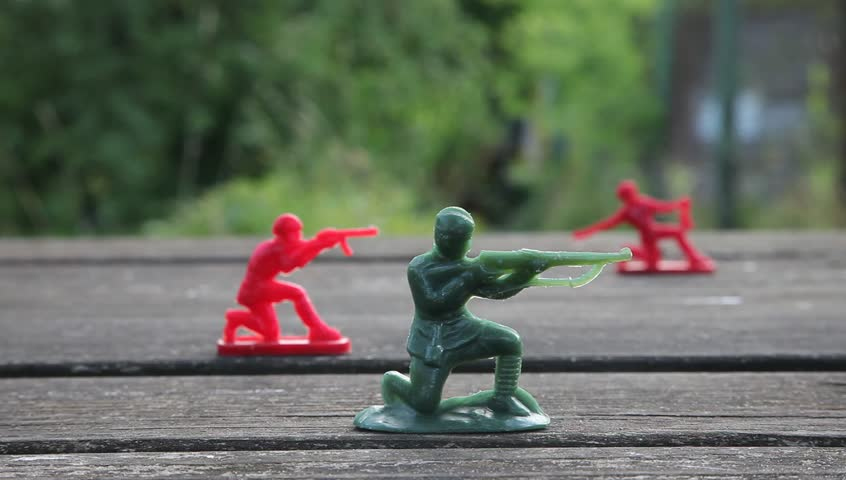

# Green vs Red



## Table of Contents

- [Dependencies](#dependencies)
- [Technologies](#technologies)
- [Description](#description)
- [Examples](#examples)
- [How to Use](#how-to-use)
- [Contancts](#contacts)

## Dependencies

**<ins>Script files can't be used as a module without using a server.</ins>**

**Here are some options:**

* Use [*Live Server*](https://marketplace.visualstudio.com/items?itemName=ritwickdey.LiveServer) VS Code Extension
* Use [*http-server*](https://www.npmjs.com/package/http-server) module
* Use [*WAMP*](https://sourceforge.net/projects/wampserver/) server

## Technologies

* HTML
* CSS
* Javascript OOP

## Description

'Green vs Red' is a game played on a 2D grid that in theory can be infinite (in our case we will assure that **x** <= **y** < **1 000**

Each cell on this grid can be either green (represented by 1) or red (represented by 0). The game always receives an initial state of the grid which we will call 'Generation Zero'. After that a set of 4 rules are applied across the grid and those rules form the next generation.

Rules that create the next generation:
1. Each *red* cell that is surrounded by exactly 3 or exactly 6 *green* cells will also become *green* in the next generation.
2. A *red* cell will stay *red* in the next generation if it has either 0, 1, 2, 4, 5, 7 or 8 *green* neighbours.
3. Each *green* cell surrounded by 0, 1, 4, 5, 7 or 8 *green* neighbours will become *red* in the next generation.
4. A *green* cell will stay *green* in the next generation if it has either 2, 3 or 6 *green* neighbours.

**<ins>Important facts:</ins>**

* Each cell can be surrounded by up to 8 cells. 4 on the sides and 4 on the corners. Exceptions are the corners and the sides of the grid.
* All the 4 rules apply *at the same time* for the whole grid in order for the next generation to be formed.

**Your Task:**

Create a program that accepts:

* The size of our grid - x, y (**x** being the **width** and **y** being the **height**)
* Then the next **y** lines should contain strings (long **x** characters) created by **0s** and **1s** which will represent the 'Generation Zero' state and help us build the grid.
* The last arguments to the program should be coordinates (x1 and y1) and the number N.

(x1 and y1) will be coordinates of a cell in the grid. We would like to ocalculate in how many generations from Generation Zero until generation N this cell was green. (The calculation should include Generation Zero and generation N)

Print your result in the console.

**Special requirement:** Write your game in a way that uses several classes. This will show OOP knowledge and will account for more points during the evaluation. Comments, good naming convention and documentation are also recommended.

## Examples

\# 3x3 grid, in the initial state, the second row is all 1s, how many times will the cell [1, 0] (top center) become green in 10 turns.
```
3.3
000
111
000
1, 0, 10
#expected result: 5
```

\# 4x4 grid, Input:
```
4,4
1001
1111
0100
1010
2, 2, 15
#expected result: 14 (or 1?)
```

## How to Use

Input Width and Height and press Generation Zero to generate a random grid. Click Next Generation to apply the conditions and calculate the next generation. The program is testable by clicking the Example One or Example Two buttons, which will generate a preset grid and automatically loop it as required in the [examples](#examples) above. Don't forget to check the [*dependencies!*](#dependencies)

### Contacts

[](https://www.facebook.com/angel.bozhkov.739)

[Back to The Top](#green-vs-red)